# diagrams.net Dark Mode in SVG

## CSS Media Query

To support dark mode in SVG, add the following CSS to the SVG defs section:

```
<style type="text/css">
@media (prefers-color-scheme: dark)
{
    :root {--light-color: #c9d1d9; --dark-color: #0d1117; }
    svg[style^="background-color:"] { background-color: var(--dark-color) !important; }
    g[filter="url(#dropShadow)"] { filter: none !important; }
    [stroke="rgb(0, 0, 0)"] { stroke: var(--light-color); }
    [stroke="rgb(255, 255, 255)"] { stroke: var(--dark-color); }
    [fill="rgb(0, 0, 0)"] { fill: var(--light-color); }
    [fill="rgb(255, 255, 255)"] { fill: var(--dark-color); }
    g[fill="rgb(0, 0, 0)"] text { fill: var(--light-color); }
    div[data-drawio-colors*="color: rgb(0, 0, 0)"]
        div { color: var(--light-color) !important; }
    div[data-drawio-colors*="border-color: rgb(0, 0, 0)"]
        { border-color: var(--light-color) !important; }
    div[data-drawio-colors*="border-color: rgb(0, 0, 0)"]
        div { border-color: var(--light-color) !important; }
    div[data-drawio-colors*="background-color: rgb(255, 255, 255)"]
        { background-color: var(--dark-color) !important; }
    div[data-drawio-colors*="background-color: rgb(255, 255, 255)"]
        div { background-color: var(--dark-color) !important; }
}
</style>
```

This will change the SVG according to the current *system* setting. The light and
dark color variables in the CSS can be changed to reflect the containing page
(the above example is optimized for GitHub dark theme).

Here is an example that will render in dark mode in GitHub markdown depending
on your system setting:



## CSS Target

If you need more control over dark mode in SVG images, the target CSS pseudo-class can be
used as follows. This will enable dark mode if the image is loaded with a #dark hash
property - or any other value that you assign to the SVG ID attribute. The media query
must be removed and :target must be added, resulting in the following CSS:

```
<style type="text/css">
:root {--light-color: #c9d1d9; --dark-color: #0d1117; }
svg:target[style^="background-color:"] { background-color: var(--dark-color) !important; }
:target g[filter="url(#dropShadow)"] { filter: none !important; }
:target [stroke="rgb(0, 0, 0)"] { stroke: var(--light-color); }
:target [stroke="rgb(255, 255, 255)"] { stroke: var(--dark-color); }
:target [fill="rgb(0, 0, 0)"] { fill: var(--light-color); }
:target [fill="rgb(255, 255, 255)"] { fill: var(--dark-color); }
:target g[fill="rgb(0, 0, 0)"] text { fill: var(--light-color); }
:target div[data-drawio-colors*="color: rgb(0, 0, 0)"]
    div { color: var(--light-color) !important; }
:target div[data-drawio-colors*="border-color: rgb(0, 0, 0)"]
    { border-color: var(--light-color) !important; }
:target div[data-drawio-colors*="border-color: rgb(0, 0, 0)"]
    div { border-color: var(--light-color) !important; }
:target div[data-drawio-colors*="background-color: rgb(255, 255, 255)"]
    { background-color: var(--dark-color) !important; }
:target div[data-drawio-colors*="background-color: rgb(255, 255, 255)"]
    div { background-color: var(--dark-color) !important; }
</style>
```

Dark mode can now be enabled by adding #dark to the image source:


To disable dark mode, remove #dark from the image source:


In the following example, #dark is appended to the src attribute of
all images matching *.drawio.svg if the page background is not white:

```
getComputedStyle(document.body).backgroundColor != 'rgba(0, 0, 0, 0)' ?
	document.querySelectorAll('img[src$=".drawio.svg"]').forEach(
		img => img.src += '#dark') : 0;
```
